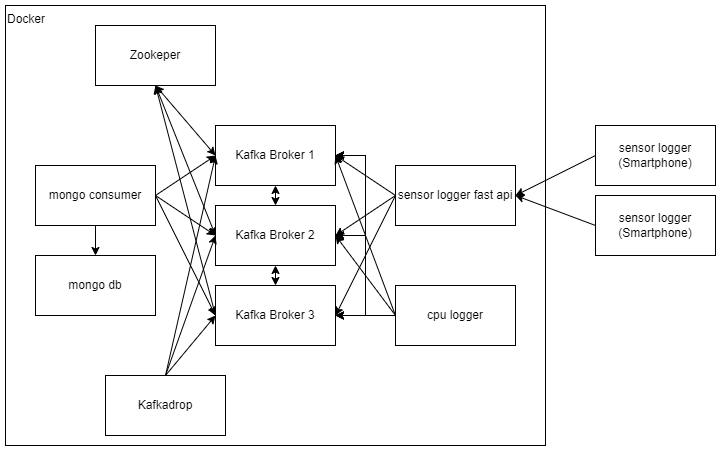

# Mini-Challenge 1 - High Performance Computing (hpc) FS23

## Containers, Communication Patterns/Frameworks and Performance Analysis

You have a client that continuously accumulates data and wants to process it further. To do this, the client wants to use the [Apache Kafka - Data Streaming Platform](https://kafka.apache.org/) in a first step. In a a second step it will use a different communication pattern. The application runs distributed in different Docker containers. Define what kind of data your client has and what problem they want to solve with it. Describe the initial situation and the problem to be solved. Then implement your methods according to the tasks below. Write a short report and answer the questions of each of the 3 parts bellow. Include meassurements/plots where meaningful.

### Part 1: Kafka Cluster and Application Setup

1. Set up Kafka locally on your computer, e.g. according to [this Kafka tutorial](https://github.com/mneedham/basic-kafka-tutorial.git). 
Note, the Docker Compose file available in the repository contains more containers than in the linked source repository.

2. Start the existing Docker containers for the Kafka cluster (Kafka Brokers and Zookeeper) locally on your computer/laptop including a Jupyter notebook. Command line:`$docker-compose up`. Verify e.g. with Docker Desktop if all containers have been started. 

    We start with a Docker compose template, which launches 6 containers:

    * broker-<x> - Kafka brokers
    * zookeeper - is used by Kafka for the leader election
    * Jupyter - Jupyter environment for the connection to our Kafka cluster using notebooks
    * kafdrop - web UI for browsing and monitoring Kafka clusters

    Note: every now and then a broker exits during startup. Just manually restart it.

3. Open the Jupyter notebook. The link to the Jupyter notebook is in the log file of the Jupyter container. The link looks something like this, where the token is individual: http://127.0.0.1:8888/?token=e3cea84dbec991e60795ee749817392f73960184cc5e5c84

4. Run the Kafka tutorial of the notebook. Use [Kafdrop]( https://github.com/obsidiandynamics/kafdrop) to monitor/explore your cluster, topics, and messages. For example, start and stop individual brokers (via Docker Desktop) or change Kafka parameters such as the replication factor (TODO WHERE???????????????????????????????????????????????) and watch how the cluster behaves via Kafdrop.
[http://127.0.0.1:9000/](http://127.0.0.1:9000/)

5. Write two different data generator functions, which regularly send messages containing data. One generator should send messages at least every second (1Hz). Choose yourself which data is sent. The application of the data can be chosen freely, but choose a good mixture of a simple and a complex message. The data should be variable. The data generator can send simulated data or real data. Use suitable Kafka components and meaningful names of functions, variables etc. for the implementation. 

- use https://github.com/hfhoffman1144/smartphone_sensor_stream
- how to choose a key: https://sprinkle-twinkles.medium.com/kafka-best-practices-edition-how-to-design-kafka-message-key-and-why-it-is-important-in-6b483b2bdb0c

    Tips:
    * Use several notebooks such that you can start and stop the endless loops of data processing individually.
    * After testing, stop the endless loop again otherwise your computer resources are unnecessarily occupied or at the limit.

6. Write a data processor and a data sink. The data processor should regularly read and process the data from the data generators. E.g., a calculation or a machine learning application on the retrieved data; a data enrichment; or the extraction of information from the message. Then the processor sends the data to a data sink. In the data sink the data is stored, e.g. in a CSV file. Use appropriate Kafka components and meaningful names of functions, variables, etc. for the implementation. 

7. Draw an overview of your application components including interfaces and data flows, for example using a component diagram. Answer the following questions and interpret your experiments or results: 

    
      * What are the tasks of the components?
        - Zookeeper: The Zookeeper is a centralized service used by Kafka for the leader election, leader election for partitions and topics. It also stores configurations for topics and sends notifications to brokers in case of changes.
        - Kafka Broker: A Kafka broker is a server that stores messages in topics. It also receives messages from producers and sends messages to consumers. The broker communicates with other brokers in the cluster to replicate data and with Zookeeper.
        - Sensor Logger FastAPI: A FastAPI application that receives sensor data from [Awesome Sensor Logger](https://github.com/tszheichoi/awesome-sensor-logger/) and inserts it into different kafka topics (for every sensor there is a topic). It is a producer.
        - CPU Logger: Logs the CPU usage of each core every 0.5 seconds and inserts it into a kafka topic. It is a producer too.
        - Kafka Drop: A web UI for browsing and monitoring Kafka clusters. It does not manage the cluster, it just reads metadata and messages from the cluster. So for the message reading part it is a consumer.
        - Mongo DB Consumer: A consumer that reads messages from the cpu topic and inserts the average over all cores into the mongo db. It is a consumer.
        - Mongo DB: A NoSQL database that stores the data in JSON format. It is used to store the average cpu usage.
      * Which interfaces do the components have?
        - Zookeeper: It has an interface that is used by the Kafka brokers to communicate with it.
        - Kafka Broker: They have two interfaces. One used for internal communication between brokers and one used for communication with the producers and consumers.
        - Sensor FastAPI: It has an HTTP interface that is used by the Awesome Sensor Logger to send the sensor data.
        - CPU Logger: Does not have an interface.
        - Kafka Drop: It has an HTTP interface that is used by the user to access the web UI.
        - Mongo DB Consumer: Does not have an interface.
        - Mongo DB: It has an interface that is used by the Mongo DB Consumer to insert data into the database.
      * Why did you decide to use these components? 
        - Zookeeper: Is helpful in electing a leader and therefore administrating the cluster.
        - Kafka Broker: Is used to store the messages in topics and to send them to the consumers. Otherwise this whole task would not be possible.
        - Sensor FastAPI: This Consumer enables me to insert sensor data from a smartphone. I choose sensor data, because it generates a lot of data (2000 messages per second) and it is a producer with high insert rate.
        - CPU Logger: This Producer enables me to insert CPU data. It is a producer with medium insert rate.
        - Kafka Drop: Good to inspect what's going on in the cluster. Are messages being inserted? Allows me to create topics and configure the partitions and replication factor.
        - Mongo DB Consumer: This Consumer enables me to process some data from kafka and insert it into a data sink (MongoDB).
        - Mongo DB: This data sink enables me to store the processed data.
      * Are there any other design decisions you have made? Which requirements (e.g. libraries, hardware, ...) does a component have?
        - I choose to insert each sensor into a separate topic. This way I can easily filter the data in the consumer.
        - I choose to use the device name, the person's name and activity as key for the sensor data. This way I can easily filter the data in the consumer.
        - I used the timestamp from each sensor datapoint as the timestamp for the kafka message.
        - I create a docker file for each consumer/producer. So I don't have to start individual jupyter notebooks.
        - I used a custom serializer/deserializer for the cpu data (comma separated values). Because the data is just a list without any key-value pairs.
        - Requirements (for my created Components):
            - Sensor FastAPI: FastAPI, uvicorn, pydantic, kafka-python and a Smartphone with the Awesome Sensor Logger installed and configured to send data to this HTTP-Server.
            - CPU Logger: kafka-python and psutil.
            - Mongo DB Consumer: kafka-python and pymongo.

#### Bonus 1
Use other serializers/deserializers instead of JSON for the messages.

### Part 2: Communication Patterns

1. Rewrite your application of part 1 using another communication pattern. You can also use another communciation framework, such as RabbitMQ and/or another underlying messaging protcol such as MQTT.
    
2. Pack your rewritten application into containers.

3. Answer the following questions and interpret your experiments or results: 
      * Which communication pattern is used by Kafka?
      * What is the difference compared to your choosen pattern?
      * What are the advantages and disadvantages of these patterns? 
      * How can you scale the two different approaches? What are ? Why? What are challenges to be considered?
      * What other 2-3 topologies/patterns do you know used for data processing? Describe the differences and use cases with at least one additional topology. 
      * Which pattern suits your chosen application best?

#### Bonus 2
Show how your container setup could be integrated into a container orchestration system (such as Kubernets) and how it would profit from this. Or show how you could replace some of the components with cloud-based offers and what changes/consideradtions come with this.

### Part 3: Performance Analysis and Evaluation

TODO some python profiling library

1. Change the scalability of your communication framework by changing the used resources. (E.g.: add brokers and/or zookeepers and play with parameters in the docker-compose file. Use orders of magnited more producers/consumers.) Perform 2-3 experiments with different configurations.

2. Analyze the performance of your application:

    * Data generators/processors: measure the average time incl. standard deviation required by your data generator loop over several runs and loops. Determine a reasonable number of runs and loop executions for the performance analysis. 
    * Data generators/processors: determine which call of your processor takes the most time. Which 3 methods are called the most or needed the most time and how much time?
    * Data generators/processors: create a profile of your processor code in a processor.prof file and create 1-2 visualizations of the profile (e.g. with [SnakeViz](https://jiffyclub.github.io/snakeviz/)).

3. Did you detect bottlenecks? Describe and discuss 1-3 detected bottlenecks. 

#### Bonus 3
Mitigate or produce a bottleneck.

## Reflection

Write a reflection on the realization of the mini-challenge. What went well? Where did problems occur? Where did you need more time than planned? 
What would you do differently in the future? What would you change in the assignment? Give examples in each case.

## Hints

### Credits

Parts of this mini-challenge are based on: https://github.com/mneedham/basic-kafka-tutorial/.

### Further Resources

* Kafka crash course: https://youtu.be/R873BlNVUB4
* Getting started with Kafka: https://towardsdatascience.com/getting-started-with-apache-kafka-in-python-604b3250aa05
* In-depth Kafka online course: https://www.udemy.com/course/apache-kafka/
* Excelent guide on low level communication patterns: https://zguide.zeromq.org/
